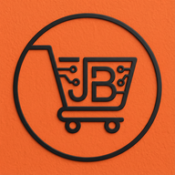

# JB Shop - Plateforme E-Commerce

<p align="center">
  
</p>

<p align="center">
  <strong>Une boutique en ligne moderne pour le Cameroun</strong>
</p>

## 📋 Description

**JB Shop** est une plateforme e-commerce complète développée avec Laravel, conçue pour offrir une expérience d'achat en ligne fluide et moderne. La plateforme permet aux utilisateurs de parcourir des produits, gérer leur panier, passer des commandes et recevoir des notifications en temps réel.

## ✨ Fonctionnalités

### 🛒 Côté Client
- **Catalogue de produits** - Navigation par catégories avec filtres et recherche
- **Panier d'achat** - Gestion complète du panier avec mise à jour en temps réel
- **Liste de souhaits** - Sauvegarde des produits favoris
- **Commandes** - Processus de commande simplifié
- **PWA** - Application Web Progressive installable sur mobile
- **Notifications** - Notifications push via Firebase Cloud Messaging
- **Intégration WhatsApp** - Communication directe avec le service client

### 👨‍💼 Côté Administration
- **Tableau de bord** - Vue d'ensemble avec statistiques et indicateurs clés
- **Gestion des produits** - CRUD complet avec images multiples, spécifications et SEO
- **Gestion des catégories** - Organisation des produits par catégories
- **Gestion des commandes** - Suivi et mise à jour du statut des commandes
- **Gestion des utilisateurs** - Administration des comptes clients
- **Alertes de stock** - Notifications pour les produits en rupture ou stock faible

## 🛠️ Technologies Utilisées

- **Backend**: Laravel 12 (PHP 8.2+)
- **Frontend**: Blade, Tailwind CSS, JavaScript
- **Base de données**: MySQL
- **Authentification**: Laravel Breeze
- **Stockage**: Laravel Storage (local/S3)
- **Notifications**: Firebase Cloud Messaging (FCM)
- **PWA**: Service Workers, Web App Manifest

## 📁 Structure du Projet

```
├── app/
│   ├── Http/Controllers/    # Contrôleurs de l'application
│   ├── Models/              # Modèles Eloquent
│   ├── Services/            # Services métier
│   └── Observers/           # Observateurs de modèles
├── resources/
│   ├── views/               # Vues Blade
│   │   ├── admin/           # Vues administration
│   │   ├── offer/           # Vues produits
│   │   ├── category/        # Vues catégories
│   │   └── components/      # Composants réutilisables
│   └── css/                 # Styles CSS
├── public/
│   ├── icons/               # Icônes PWA
│   ├── js/                  # JavaScript compilé
│   └── manifest.json        # Manifest PWA
├── routes/
│   ├── web.php              # Routes web
│   └── auth.php             # Routes authentification
└── database/
    ├── migrations/          # Migrations de base de données
    └── seeders/             # Seeders de données
```

## ⚙️ Installation

### Prérequis
- PHP 8.2 ou supérieur
- Composer
- Node.js & NPM
- MySQL

### Étapes d'installation

1. **Cloner le dépôt**
   ```bash
   git clone https://github.com/BoreilFobs/jbcommerce.git
   cd jbcommerce
   ```

2. **Installer les dépendances PHP**
   ```bash
   composer install
   ```

3. **Installer les dépendances JavaScript**
   ```bash
   npm install
   ```

4. **Configurer l'environnement**
   ```bash
   cp .env.example .env
   php artisan key:generate
   ```

5. **Configurer la base de données**
   - Créer une base de données MySQL
   - Mettre à jour les informations dans `.env`

6. **Exécuter les migrations**
   ```bash
   php artisan migrate
   ```

7. **Créer le lien de stockage**
   ```bash
   php artisan storage:link
   ```

8. **Compiler les assets**
   ```bash
   npm run build
   ```

9. **Lancer le serveur de développement**
   ```bash
   php artisan serve
   ```

## 🚀 Déploiement

### Configuration serveur recommandée
- Ubuntu 22.04 LTS
- Apache 2.4 ou Nginx
- PHP 8.2+ avec extensions requises
- MySQL 8.0+
- SSL/HTTPS (requis pour PWA)

### Variables d'environnement importantes
```env
APP_ENV=production
APP_DEBUG=false
APP_URL=https://votre-domaine.com

DB_CONNECTION=mysql
DB_HOST=127.0.0.1
DB_DATABASE=jbshop
DB_USERNAME=votre_utilisateur
DB_PASSWORD=votre_mot_de_passe

MAIL_MAILER=smtp
# Configuration email...

# Firebase (pour notifications push)
FIREBASE_CREDENTIALS=chemin/vers/credentials.json
```

## 📱 PWA (Progressive Web App)

L'application est installable sur les appareils mobiles grâce à la technologie PWA:
- Fonctionne hors ligne (pages mises en cache)
- Installable sur l'écran d'accueil
- Notifications push
- Expérience native sur mobile

## 🔐 Sécurité

- Authentification sécurisée avec Laravel
- Protection CSRF sur tous les formulaires
- Validation des données côté serveur
- Échappement automatique des données affichées
- Mots de passe hashés avec bcrypt

## 📞 Support

Pour toute question ou assistance:
- **Site web**: [jbshop237.com](https://jbshop237.com)
- **WhatsApp**: Intégré dans l'application

## 📄 Licence

Ce projet est sous licence propriétaire. Tous droits réservés.

---

<p align="center">
  Développé avec ❤️ au Cameroun
</p>
